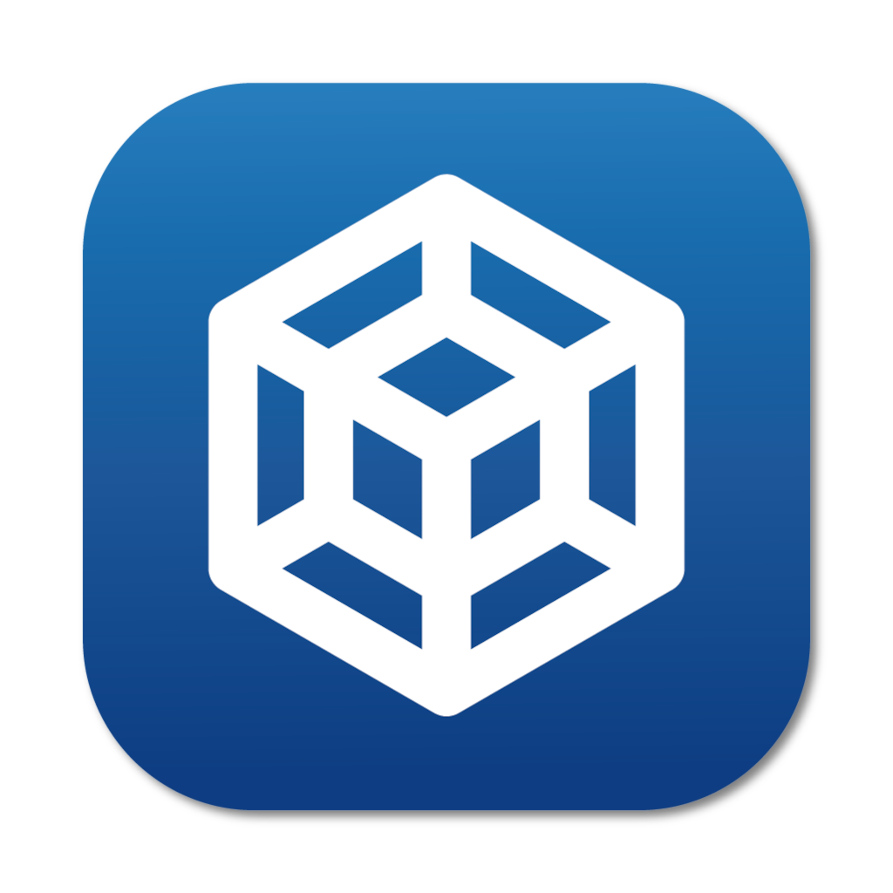

# The Tesseract Project

  

  
  
  

  
Welcome to the official website repository for <strong>Tesseract</strong> Your gateway to seamless virtual machine management.

## Table of Contents

- [About Tesseract](#about-Tesseract)
- [Technologies Used](#technologies-used)
- [Minimum Requirements](#minimum-requirements)
- [Getting Started](#getting-started)
- [License](#license)
- [Contact](#contact)

## About Tesseract

Tesseract is a cutting-edge virtual machine manager that redefines simplicity and efficiency in managing virtual environments. Tailored for professionals and enthusiasts alike, Tesseract empowers you to:

- **Deploy** virtual machines in minutes.
- **Manage** multiple VMs effortlessly through an intuitive dashboard.
- **Monitor** resource usage in real-time.
- **Automate** routine tasks with powerful scripting capabilities.

> [!TIP]
> Discover more at [Tesseract's official website](https://iomega8561.github.io/TesseractProject/).

## Technologies Used

Tesseract is developed using the latest Apple technologies to provide a seamless and native experience on macOS:

- **SwiftUI** for building a modern, intuitive user interface.
- **AppKit** for integrating with macOS features.
- **SwiftData** for efficient data management.
- **VirtualizationKit**: for having a solid foundation to build robust and compelling virtualization features.

> [!NOTE]
> VirtualizationKit is a new, modern, custom framework, built from scratch entirely by me.  
> This framework wraps Apple's own Virtualization Framework and enhances performance and stability.

## Minimum Requirements

> [!WARNING]
> To be able to use this application, please make sure your system meets the following requirements:

- **Processor**: Apple Silicon (M1, M2, or newer)
- **Operating System**: macOS Sonoma 14.0 or later

## Getting Started

Experience the power of Tesseract by downloading it today!

> [!TIP]
> Tesseract will soon be available on the **macOS App Store**

### Download from Latest Release

Alternatively, you can download the latest release directly from our repository:

1. **Visit the [Latest Releases](https://github.com/iOmega8561/TesseractProject/releases/latest) page.**
2. **Download the latest `.dmg` file compatible with your system.**
3. **Open the downloaded file and follow the installation instructions**.

## License

The website hosted in this repository is distributed under the MIT License. See [LICENSE](LICENSE) for more information.

> [!CAUTION]
> The Tesseract logo, code and any related assets, are not covered under MIT and are protected under &copy; copyright law.  
> Unauthorized use, reproduction, or distribution of the logo or any of the assets, is prohibited. Tesseract is covered by its own EULA.

> [!IMPORTANT]
> You can consult Tesseract's End User License Agreement [here](https://iomega8561.github.io/TesseractProject/eula.html)

## Contact

For any inquiries or feedback, please feel free to open issues using this repository.
